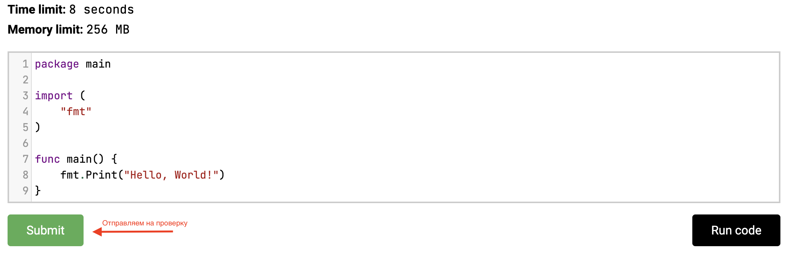

# Сдаем первую программу
Теперь осталось сдать написанную нами программу в тестирующую систему Stepik. Для этого

1. Скопируйте только что написанный код в окно ввода решения задачи. Дублирую то что надо скопировать:

```go
package main

import (
    "fmt"
)

func main() {
    fmt.Print("Hello, World!")
}
```
2. Нажмите Отправить (Submit)

